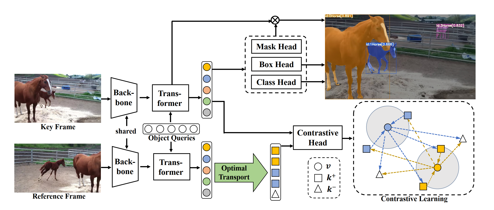
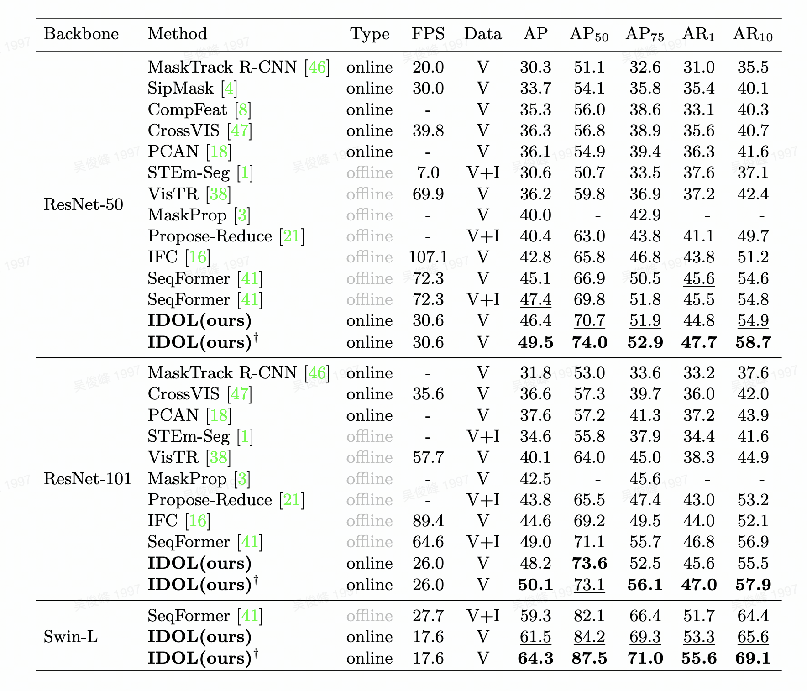
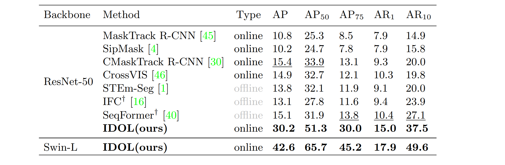
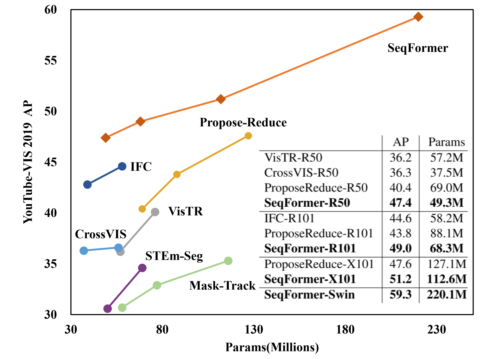
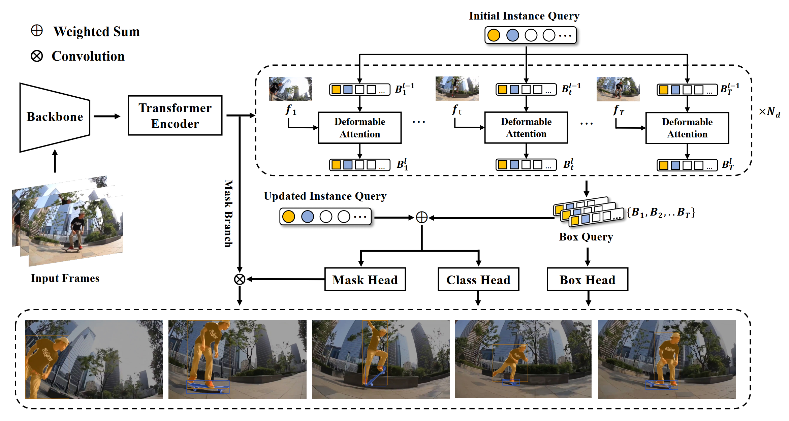
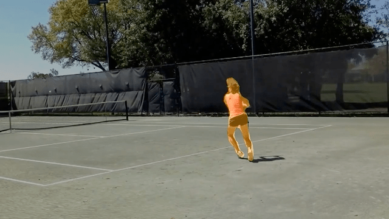
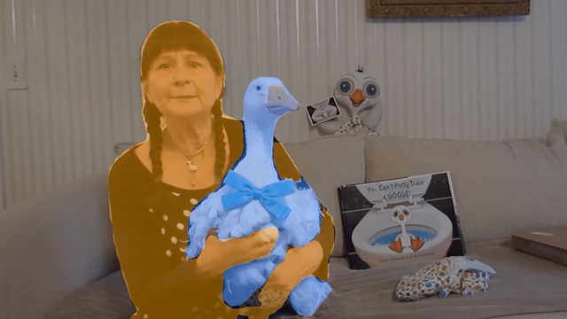
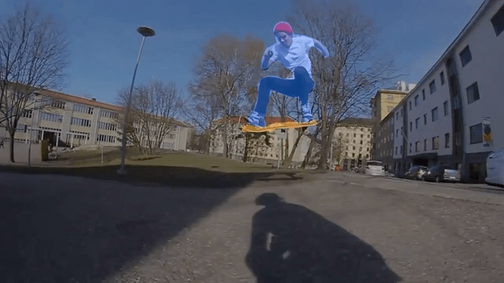
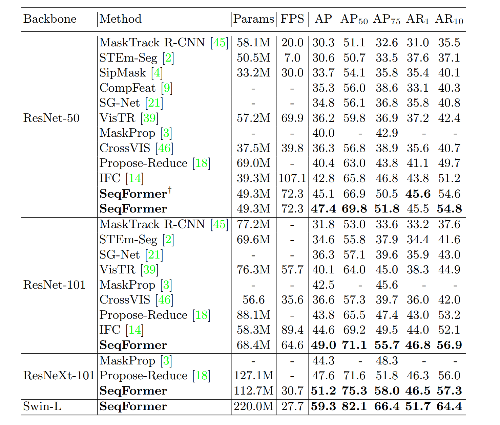
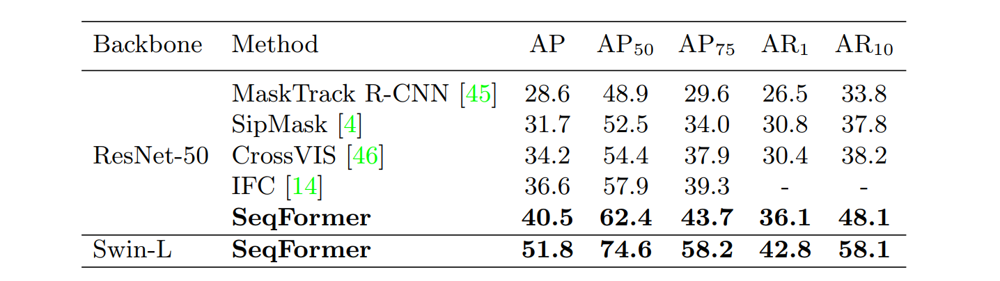

# VNext: 


<p align="center"></p>


- VNext is a **Next**-generation **V**ideo instance recognition framework on top of [Detectron2](https://github.com/facebookresearch/detectron2). 
- Currently it provides advanced online and offline video instance segmentation algorithms. 
- We will continue to update and improve it to provide a unified and efficient framework for the field of video instance recognition to nourish this field.


To date, VNext contains the official implementation of the following algorithms:

IDOL: In Defense of Online Models for Video Instance Segmentation (ECCV2022 Oral)

SeqFormer: Sequential Transformer for Video Instance Segmentation (ECCV2022 Oral)


## Highlight:

- IDOL is accepted to ECCV 2022 as an **oral presentation**!
- SeqFormer is accepted to ECCV 2022 as an **oral presentation**!
- IDOL won **first place** in the video instance segmentation track of the 4th Large-scale Video Object Segmentation Challenge (CVPR2022).


## Getting started

1. For Installation and data preparation, please refer to  to [INSTALL.md](./INSTALL.md) for more details.
2. For IDOL training, evaluation, and model zoo, please refer to [IDOL.md](./projects/IDOL/IDOL.md)

3. For SeqFormer training, evaluation and model zoo, please refer to [SeqFormer.md](./projects/SeqFormer/SeqFormer.md)


## IDOL

[](https://paperswithcode.com/sota/video-instance-segmentation-on-youtube-vis-1?p=in-defense-of-online-models-for-video)
[](https://paperswithcode.com/sota/video-instance-segmentation-on-youtube-vis-2?p=in-defense-of-online-models-for-video)
[](https://paperswithcode.com/sota/video-instance-segmentation-on-ovis-1?p=in-defense-of-online-models-for-video)


[In Defense of Online Models for Video Instance Segmentation](https://arxiv.org/abs/2207.10661)

Junfeng Wu, Qihao Liu, Yi Jiang, Song Bai, Alan Yuille, Xiang Bai


### Introduction


- In recent years, video instance segmentation (VIS) has been largely advanced by offline models, while online models are usually inferior to the contemporaneous offline models by over 10 AP, which is a huge drawback.

- By dissecting current online models and offline models, we demonstrate that the main cause of the performance gap is the error-prone association and  propose IDOL, which outperforms all online and offline methods on three benchmarks. 

- IDOL won first place in the video instance segmentation track of the 4th Large-scale Video Object Segmentation Challenge (CVPR2022). 


<p align="center"></p>

 

### Visualization results on OVIS valid set

 


### Quantitative results

#### YouTube-VIS 2019


<p align="center"></p>

 

#### OVIS 2021


<p align="center"></p>

 

## 

## SeqFormer

[](https://paperswithcode.com/sota/video-instance-segmentation-on-youtube-vis-1?p=seqformer-a-frustratingly-simple-model-for)


<p align="center"></p>

[SeqFormer: Sequential Transformer for Video Instance Segmentation](https://arxiv.org/abs/2112.08275)

Junfeng Wu, Yi Jiang, Song Bai, Wenqing Zhang, Xiang Bai


### Introduction


- SeqFormer locates an instance in each frame and aggregates temporal information to learn a powerful representation of a video-level instance, which is used to predict the mask sequences on each frame dynamically. 

- SeqFormer is a robust, accurate, neat offline model and instance tracking is achieved naturally without tracking branches or post-processing. 


<p align="center"></p>

 

### Visualization results on YouTube-VIS 2019 valid set

 





### Quantitative results

#### YouTube-VIS 2019


<p align="center"></p>

 

#### YouTube-VIS 2021


<p align="center"></p>

 

#### 


## Citation

```
@inproceedings{seqformer,
  title={SeqFormer: Sequential Transformer for Video Instance Segmentation},
  author={Wu, Junfeng and Jiang, Yi and Bai, Song and Zhang, Wenqing and Bai, Xiang},
  booktitle={ECCV},
  year={2022},
}

@inproceedings{IDOL,
  title={In Defense of Online Models for Video Instance Segmentation},
  author={Wu, Junfeng and Liu, Qihao and Jiang, Yi and Bai, Song and Yuille, Alan and Bai, Xiang},
  booktitle={ECCV},
  year={2022},
}
```

## Acknowledgement

This repo is based on [detectron2](https://github.com/facebookresearch/detectron2), [Deformable DETR](https://github.com/fundamentalvision/Deformable-DETR), [VisTR](https://github.com/Epiphqny/VisTR), and [IFC](https://github.com/sukjunhwang/IFC)  Thanks for their wonderful works.
